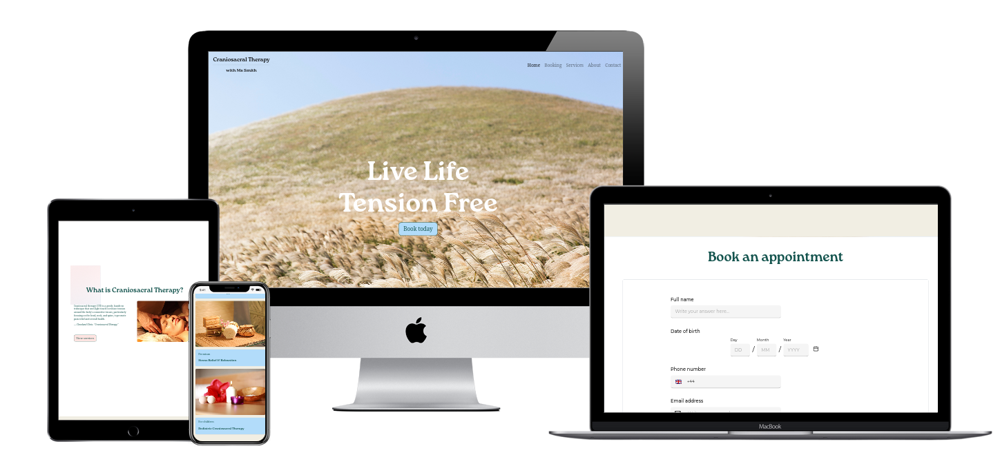

# Craniosacral Therapy Website

This is a simple, responsive website for **Craniosacral Therapy** services offered by Ms. Smith. It includes information about the therapy, services, booking appointments, and a contact form for inquiries.



## Features

- **Navigation Bar**: Quick links to different sections (Home, Booking, Services, About, Contact).
- **Hero Section**: A welcoming section with a call-to-action button to book appointments.
- **About Section**: Information on Craniosacral Therapy and its benefits.
- **Services Gallery**: Displays the various services offered with an interactive popup for more information.
- **Booking Section**: Embeds an iframe for easy appointment booking.
- **Contact Form**: Allows users to reach out with their inquiries and contact information.
- **Footer**: Information on the website’s creation and licensing.

## Technologies Used

- **HTML5** for structuring the website.
- **CSS3** for styling the website, including custom font integration and responsive layout.
- **Bootstrap 4** for responsive grid and components like navigation bar and buttons.
- **JavaScript** for interactivity, such as the image popup and form validation.

## File Structure

```
/cranial-therapy-website
│
├── index.html          # The main HTML file
├── styles.css          # CSS file for styling
├── /images             # Folder containing images used in the website
│   ├── hero.jpg
│   ├── image1.jpg
│   ├── image2.jpg
│   └── image3.jpg
├── LICENSE             # License file (if applicable)
├── Roca Bold.ttf       # Font file
└── README.md           # This file
```

## Installation Instructions

To run the website locally:

1. Clone the repository:
   ```bash
   git clone https://github.com/aria-vero-s/craniosacral_therapy.git
   ```

2. Navigate to the project folder:
   ```bash
   cd cranial-therapy-website
   ```

3. Open `index.html` in your browser to view the website locally.

## License

This project is licensed under the [MIT License](LICENSE).

## Credits

Website created by [Ariane Saulnier](https://github.com/Aria-vero-s/).
